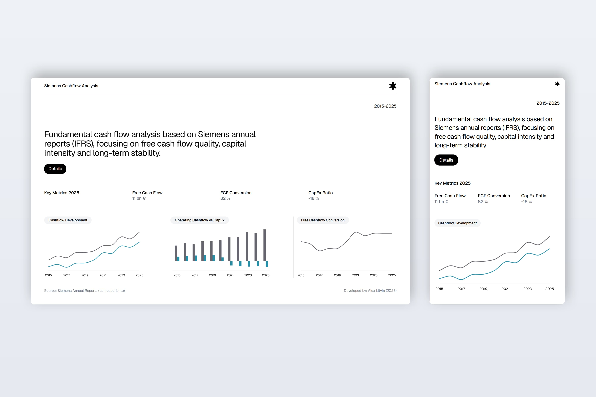
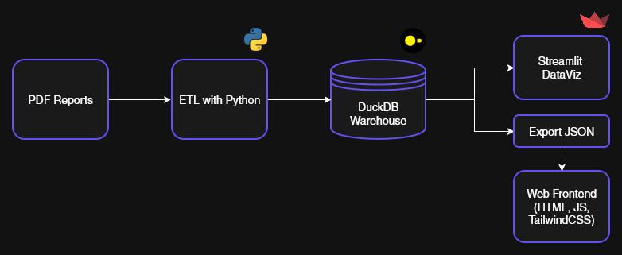

# Siemens Cash Flow Analysis

A data-focused project analyzing Siemens AG’s cash flow performance across fiscal years using publicly available annual reports. The project combines an end-to-end ETL pipeline with analytical storage (DuckDB) and two visualization layers: a Streamlit dashboard and a minimalist web frontend.



## Project Overview

This project extracts, transforms, and analyzes cash flow data from Siemens annual reports (IFRS), with a focus on:

- Operating Cash Flow
- Capital Expenditures (CapEx)
- Free Cash Flow (FCF)
- CapEx Ratio
- Free Cash Flow Conversion

> [!NOTE]
> The goal is to demonstrate a **clean analytical pipeline**, not financial advice.

## Table of Contents

- [Tech Stack](#tech-stack)
- [Architecture Overview](#architecture-overview)
- [Setup](#setup)
- [ETL Execution Order](#etl-execution-order)
- [Data Model](#data-model)
- [Visualizations](#visualizations)
- [Demo](#demo)
- [License](#license)
- [Author](#author)

## Tech Stack

### Data & ETL Pipeline

- Python
- DuckDB
- Pandas
- PDF Parsing tools

### Visualization

- HTML, JS, Tailwind CSS
- Chart.js
- Streamlit

## Architecture Overview



## Setup

> [!IMPORTANT]
> Before running the ETL pipeline, make sure Python dependencies are installed.

> [!TIP]
> It is recommended to use a virtual environment.

## ETL Execution Order

Run the ETL pipeline in the following order:

### Extract

Parses required data from Siemens annual report PDFs.

```bash
   python etl/extract/extract_cashflow.py
```

### Transform

Cleans extracted data and computes derived metrics.

```bash
   python etl/transform/transform_cashflow.py
```

### Load

Loads transformed data into DuckDB.

```bash
   python etl/load/load_to_db.py
```

### Export data (for Web Frontend)

Exports data from DuckDB to JSON.

```bash
   python etl/export/export_to_json.py
```

## Data Model

Main analytical table:

siemens_cashflow
├── fiscal_year
├── operating_cashflow
├── capex
├── free_cashflow
├── capex_ratio
└── fcf_margin

## Visualizations

### Streamlit Dashboard

A quick analytical interface for exploration and validation.

```bash
   streamlit run dashboard/app.py
```

### Web Frontend

A minimalist frontend built with:

- HTML
- JavaScript
- Tailwind CSS
- Chart.js
- Static JSON data

## Demo (Web Frontend)

- [Project's live frontend demo](https://hhlitval.github.io/siemens-cashflow-analysis/)

## License

This project is open-source and licensed under the [MIT License](LICENSE).

## Author

**Developed by [Alex Litvin](https://alexlitvin.com)**
